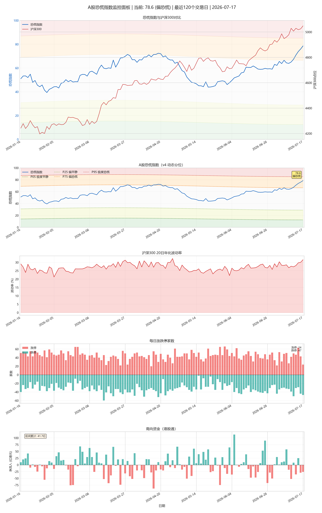

# A股恐慌指数监控 (A-Share Panic Index)

[](https://python.org)
[](LICENSE)

> A股市场压力指数计算与监控工具，支持动态分位情绪分级、结构化日报、历史回测和告警事件输出。



## ✨ 功能特性

### 核心功能
- 📊 **恐慌指数计算** - 基于波动率、涨跌停比、期货贴水、南向资金的多维度指数
- 📈 **实时监控** - 支持盘中数据获取和历史趋势分析
- 🧪 **策略回测** - 验证恐慌指数对投资决策的有效性
- 🚨 **智能告警** - 飞书/微信/邮件推送，关键点位自动提醒
- 💾 **数据存储** - SQLite数据库，支持增量更新和历史查询

### 技术指标
| 指标 | 权重 | 说明 |
|-----|-----|-----|
| 隐含波动率 | 40% | 沪深300指数20日历史波动率 |
| 涨跌停比 | 30% | 跌停家数/涨跌停总数 |
| 期货贴水 | 20% | 股指期货与现货基差 |
| 南向资金 | 10% | 港股通资金流向 |

### 动态情绪分级
```
低于动态P05: 🟢 极度平静
P05-P25:      🟡 偏平静
P25-P75:      ⚪ 中性
P75-P95:      🟠 偏恐慌
高于动态P95: 🔴 极度恐慌
```

四项指标使用此前最多504个交易日计算经验分位；当天数据不参与当天标准化。动态阈值由252日和756日历史分位按30%/70%混合，并使用EMA20平滑。分级无滞回，通知降噪由外部工作流处理。

## 🚀 快速开始

### 安装依赖

```bash
pip install -r requirements.txt
```

### 使用CLI工具

```bash
# 进入项目目录
cd a-share-panic-index

# 获取当前恐慌指数
python3 cli.py current

# 生成单次结构化日报（Hermes/自动化推荐）
python3 scripts/cli.py daily

# 查看历史数据
python3 cli.py history --days 30

# 生成图表
python3 cli.py chart --type comprehensive --output chart.png

# 运行回测
python3 cli.py backtest

# 指定日期或独立数据库
python3 scripts/cli.py daily --date 2026-07-17 --database ./data_cache/panic_index.db
```

`daily` 的标准输出只有一个UTF-8 JSON对象，日志写入标准错误和
`logs/daily.log`。退出码 `0/2/3/4/5/6` 分别表示成功、配置错误、
数据过期、指标不完整、计算或存储失败、未预期错误。

系统按上交所交易日历判断目标日期，15:30后要求取得当日数据；主历史源
尚未更新时会切换到当日备选源，并将结果标记为 `provisional`，后续运行
自动使用主历史源复核覆盖。

`result.emotion` 包含模型版本、历史分位、动态阈值、趋势和等级变化事件；
`result.signal` 只提供观察提示，不直接输出买卖建议。

### Python API

```python
from core.calculator import PanicIndexCalculator
from data.database import Database
from viz.charts import Visualizer

# 获取数据
db = Database()
df = db.get_latest(30)

# 计算恐慌指数
calc = PanicIndexCalculator()
latest = df.iloc[-1]
signal = calc.get_signal(latest['panic_index'])

# 生成图表
viz = Visualizer()
viz.plot_comprehensive(df, raw_data, 'output.png')
```

## 📁 项目结构

```
a-share-panic-index/
├── alerts/                 # 告警推送
│   └── notifier.py         # 告警管理
├── cli/                    # CLI命令模块
│   ├── commands/           # 命令实现
│   │   ├── current.py      # 当前恐慌指数
│   │   ├── history.py      # 历史数据
│   │   ├── chart.py        # 图表生成
│   │   ├── backtest.py     # 策略回测
│   │   ├── alert.py        # 告警测试
│   │   ├── config.py       # 配置管理
│   │   └── monitor.py      # 监控模式
│   └── __init__.py
├── config/                 # 配置管理
│   ├── settings.yaml       # 配置文件
│   └── __init__.py         # Config类
├── core/                   # 核心算法
│   ├── calculator.py       # 恐慌指数计算
│   └── backtest.py         # 回测引擎
├── data/                   # 数据层
│   ├── async_manager.py    # 异步数据管理
│   ├── cache.py            # 缓存管理
│   ├── database.py         # SQLite数据库
│   ├── manager.py          # 数据管理器
│   └── __init__.py
├── fetchers/               # 数据获取
│   ├── async_base.py       # 异步获取器基类
│   ├── base.py             # 获取器基类
│   ├── batch_fetcher.py    # 批量数据获取
│   ├── fund_flow.py        # 资金流向
│   ├── futures.py          # 期货数据
│   ├── index.py            # 指数数据
│   └── limit_up.py         # 涨跌停数据
├── tests/                  # 单元测试
│   ├── test_all.py
│   ├── test_cli.py         # CLI命令测试
│   └── test_data.py        # 数据模块测试
├── viz/                    # 可视化
│   └── charts.py           # 图表生成
├── cli.py                  # CLI主入口
├── exceptions.py           # 异常定义
├── utils.py                # 工具函数
├── README.md               # 本文档
├── README_CN.md            # 中文文档
├── LICENSE                 # MIT许可证
├── pyproject.toml          # 项目配置
└── requirements.txt        # 依赖项
```

## ⚙️ 配置说明

编辑 `config/settings.yaml`:

```yaml
# 权重配置
weights:
  implied_volatility: 0.40
  limit_up_down_ratio: 0.30
  futures_premium: 0.20
  southbound_flow: 0.10

# 动态情绪模型
emotion_model:
  version: "2.0"
  component_window: 504
  min_periods: 252
  short_threshold_window: 252
  long_threshold_window: 756
  short_weight: 0.30
  long_weight: 0.70
  smoothing_span: 20
  quantiles:
    extreme_calm: 0.05
    calm: 0.25
    panic: 0.75
    extreme_panic: 0.95

# 告警配置
alerts:
  enabled: true
  feishu:
    enabled: false
    webhook_url: "your-webhook-url"
  email:
    enabled: false
    smtp_server: smtp.example.com
    smtp_port: 587
    smtp_user: your_email@example.com
    smtp_password: your_password
    to_email: recipient@example.com
```

## 📊 数据源

- **指数数据**: [Baostock](http://baostock.com/) (首选) / [akshare](https://www.akshare.xyz/) (新浪财经，备用)
- **涨跌停数据**: 金融界API
- **期货数据**: 新浪财经
- **资金流向**: 东方财富

## 🧪 测试

```bash
# 运行默认离线测试
python -m unittest discover -s tests -v
```

测试覆盖:
- 恐慌指数计算
- 历史滚动分位标准化和未来数据隔离
- 长短周期动态阈值、EMA平滑和无滞回分级
- 趋势、等级变化事件和数据库审计字段
- 回测引擎
- 配置管理

## 📈 回测策略

旧版回测模块仍支持以下策略，但不会被 `daily` 自动转换为买卖建议：
- `extreme_panic_buy`: 恐慌>80买入，<20卖出
- `panic_buy`: 恐慌>60买入，<40卖出  
- `contrarian`: 反向策略

回测指标:
- 总收益率 / 年化收益率
- 最大回撤
- 夏普比率
- 胜率

## 🔔 Hermes通知事件

```json
{
  "level": "极度恐慌",
  "event": "entered_extreme_panic",
  "trend": "快速升温",
  "level_changed": true
}
```

`daily` 只输出等级和变化事件。是否每天发送、只在等级变化时发送，或极端状态持续时重复提醒，由Hermes工作流配置，不在情绪模型中加入滞回或买卖规则。

## 📝 更新日志

### v4.0.0 (2026-07-17)
- ✅ 使用历史滚动分位替代全历史Min-Max标准化
- ✅ 增加252/756日混合动态阈值和EMA20平滑
- ✅ 增加无滞回五档压力分级、趋势和等级变化事件
- ✅ 数据库保存每日阈值、历史分位和模型版本
- ✅ 情绪信号改为观察型提示，不直接输出买卖指令

### v2.2.0 (2026-04-15)
- ✅ 添加Baostock指数数据源（首选）
- ✅ 更新图表时间周期为2年
- ✅ 修复波动率计算和显示问题
- ✅ 优化非交易日数据处理
- ✅ 完善数据缓存机制

### v2.1.0 (2026-04-15)
- ✅ 增加北向资金数据源
- ✅ 增加邮件告警渠道
- ✅ 优化权重配置
- ✅ 完善单元测试
- ✅ 修复数据处理bug

### v2.0.0 (2026-03-28)
- ✅ 模块化架构重构
- ✅ SQLite数据库支持
- ✅ YAML配置管理
- ✅ CLI命令行工具
- ✅ 策略回测功能
- ✅ 告警推送系统
- ✅ 单元测试覆盖

### v1.0.0 (2026-03-26)
- 初始版本
- 基础恐慌指数计算

## 🤝 贡献指南

欢迎提交Issue和PR！

1. Fork 项目
2. 创建特性分支 (`git checkout -b feature/amazing`)
3. 提交更改 (`git commit -m 'Add amazing'`)
4. 推送分支 (`git push origin feature/amazing`)
5. 创建 Pull Request

## 📄 许可证

[MIT License](LICENSE)

## 👤 作者

**旺大神** - [GitHub](https://github.com/yourname)

---

> ⚠️ **免责声明**: 本工具仅供学习研究使用，不构成投资建议。股市有风险，投资需谨慎。
